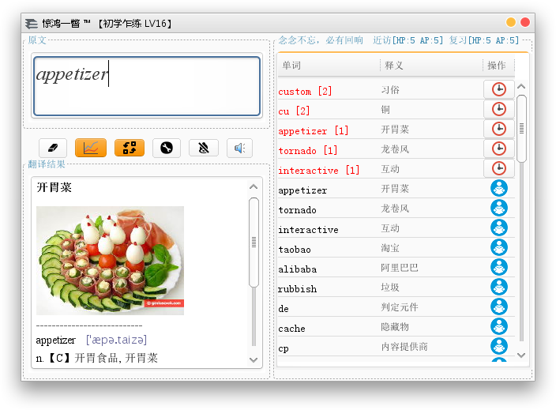
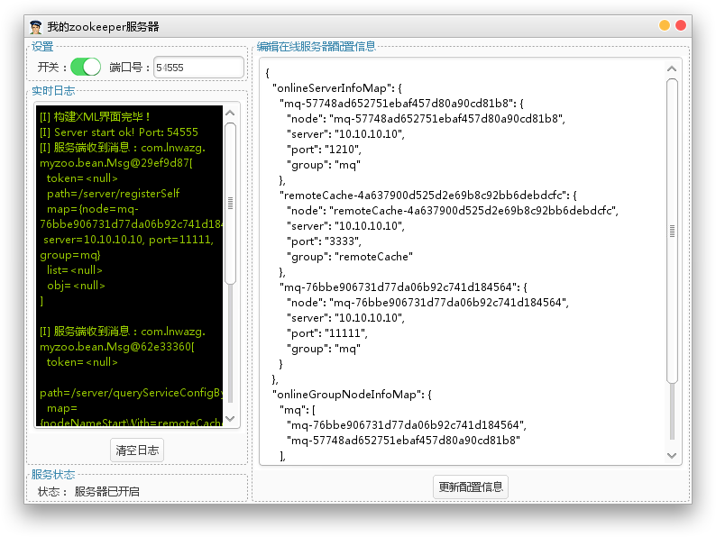
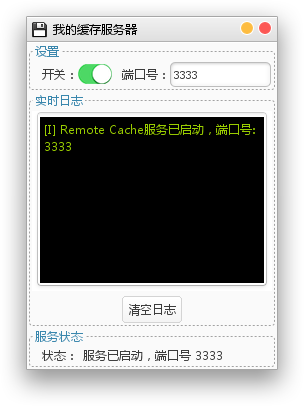
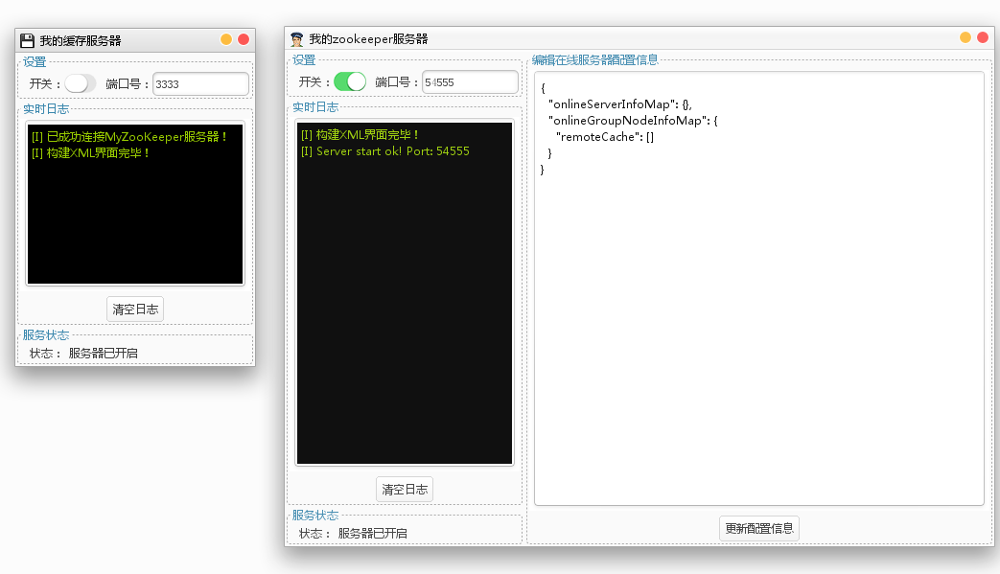
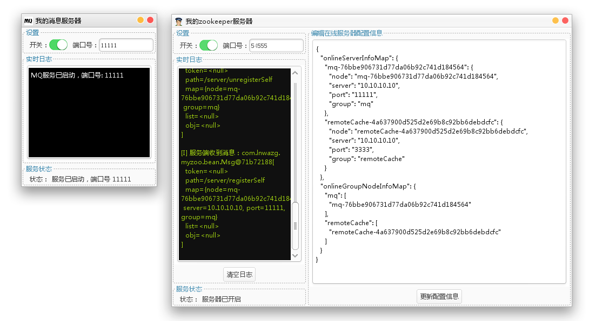

# JavaSwingSoftwares
以下我自己编写的一系列基于Java Swing的桌面应用，开箱即用，简单便捷。  
编写这些软件的初衷，是为了让我所掌握的Java技术更好地服务于我的工作与生活。  
当我发现，使用swing也可以绘制出漂亮且高效的桌面应用时，我开启了新世界！  
  
请注意，使用这些软件的前提是要安装JDK8运行环境。  
JDK8的下载地址为：http://www.oracle.com/technetwork/java/javase/downloads/jdk8-downloads-2133151.html   
若有疑问或建议，请邮件我，我的联系方式如下：  

QQ：  914096874  
邮箱: lnwazg@126.com  
联系电话：18913957098


## 1. AutoShadow 基于java swing的翻墙工具
这款小工具可以帮助你有效地翻墙。软件运行截图如下:  


### 使用步骤：  
1. 下载并安装jdk8  
2. 下载AutoShadow文件夹内的AutoShadow-1.1.jar，双击打开  
3. 然后点击软件的“在线1”或者“在线2”或者“在线3”按钮，如果线路可用，则软件的任务栏图标将显示为绿色的，否则为红色的。绿色状态下可以正常翻墙，红色状态下无法翻墙。  
4. 打开chrome浏览器，在地址栏输入  chrome://extensions/  
5. 将附件里的SwitchySharp.crx拖入到你的扩展程序里，并安装
6. 打开SwitchySharp的配置选项，点击“从文件恢复”，选择附件里下载的SwitchyOptions.bak，导入即可   
   
7. 点击浏览器右上角的插件，下拉选择“自动切换模式”，然后尽情享用吧。   
    
8. 打开https://www.youtube.com/ 检测一下你是否可以正常翻墙。如果可以正常打开，说明已经翻墙成功了，have fun！  
    

## 2. GoogleTranslate  惊鸿一瞥 背单词神器
软件特色：  
1. 内置艾宾浩斯记忆曲线，高效有趣地背单词  
2. 快捷键PrintScreen一键呼出\关闭  
3. 中翻英、英翻中、独家配备精美单词插图解释，可视化的记忆，高效自然  
4. 智能发音、等级称号成就系统，越用你的英文水平就越强大

运行截图如下：  



下载GoogleTranslate-1.3.3.jar，双击运行即可。
另附详尽的使用说明书《GoogleTranslate用户手册 v1.1.docx》

## 3. MY_ZOO_SERVER  我的zookeeper服务器
### 诞生初衷：
原本我是想用Java复刻zookeeper，但是复刻的难度太大，随后发现复刻zookeeper的Naming Service功能更加简单易实施。    
Naming Service的原理并不复杂，但是提供一个简单好用的Naming Service中间件依然是一件颇具挑战的事情。  

### 解决方案：
依然是采用我最擅长的SwingXml组件作为桌面软件的展示层，底层采用kryonet作为通信层，实现Naming Service的原理即可。

### 软件介绍：
通信层基于kryonet，功能高仿zookeeper，但是更加可视化、实用化。  
提供了命名服务、服务注册、服务卸载、智能下线检测等功能。  
服务信息在服务上线时自动注册，服务下线时自动解除注册。  
也可以根据自己的需要手动调整在线服务的注册信息。  


## 4. CACHE_SERVER  纯java的类redis缓存服务器  
### 诞生初衷：
redis的设计思想决定了其运行需要占用大量的内存。那么，是否可能有这样的一款软件，提供网络访问接口，能够提供近似于redis的使用体验，却又无须占用大量的内存，可以部署在任意低内存的机器上，并且还可以存储海量的数据？  

### 解决方案：
使用ehcache + rmi + JDK serialization进行组合，即可实现提供以上的功能。  

### 特色：
这款缓存服务器可以让你方便地存储任意的键值对到本地磁盘中，api高仿redis，使用轻巧方便，可以自定义端口号，双击即可使用。  
可以和MY_ZOO_SERVER进行集成，通用命名服务进行访问，所有的配置信息都由MY_ZOO_SERVER统一管理，高效可视化。  

### New！
现提供多租户支持功能！启动客户端时，可以指定业务Id，那么所有的操作都将在该业务Id内执行，多个业务Id之间的数据互相隔离。  
初始化的方法如下：    
cache = RemoteCacheServer.initConfig(m.get("server"), Integer.valueOf(m.get("port")), "yourBusinessId");

### 提供的基本功能如下：
put(Serializable key, Serializable value)     将任意键值对放入到redis缓存   
get(Serializable key, Class<T> classType)     根据key取出相对应的缓存对象，并将结果转换为指定的类型  
get(Serializable key)                         根据key取出相对应的缓存对象                
remove(Serializable key)                      移除掉某个key  
incr(Serializable key)						  将某个key对应的对象的值+1  
decr(Serializable key)                        将某个key对应的对象的值-1      

##### 脱离MY_ZOO_SERVER单独运行的截图如下：  


##### 配合MY_ZOO_SERVER，运行状态如下：  
服务开启前状态：  

服务开启后状态： 


通过以上的状态对比，我们就能明白MY_ZOO_SERVER的设计思想及其可视化效果的优势以及特色。


CACHE_SERVER配合MY_ZOO_SERVER使用的代码示例：  

```

package com.lnwazg.component.demo;

import java.util.Map;

import com.lnwazg.cache.client.RemoteCacheServer;
import com.lnwazg.cache.proxy.Cache;
import com.lnwazg.kit.log.Logs;
import com.lnwazg.kit.testframework.TF;
import com.lnwazg.kit.testframework.anno.PrepareStartOnce;
import com.lnwazg.kit.testframework.anno.TestCase;
import com.lnwazg.myzoo.framework.MyZooKeeper;

/**
 * 我的缓存服务器，使用demo
 * @author nan.li
 * @version 2017年2月28日
 */
public class MyCacheServerDemo
{
    Cache cache = null;
    
    /**
     * 初始化测试环境
     * @author nan.li
     */
    @PrepareStartOnce
    void prepareGlobalOnlyOnce()
    {
        boolean success = MyZooKeeper.initDefaultConfig();
        if (success)
        {
            Map<String, String> m = MyZooKeeper.queryServiceConfigByNodeNameStartWithThenChooseOne("remoteCache");
            //初始化redis服务器
            cache = RemoteCacheServer.initConfig(m.get("server"), Integer.valueOf(m.get("port")));
        }
        else
        {
            Logs.e("MyZooKeeper集群初始化失败！");
        }
    }
    
    /**
     * 存任意对象
     * @author nan.li
     */
    //    @TestCase
    void testSave()
    {
        //存
        cache.put(5, 100.78D);
        cache.put(5, 100.746348965893486948d);
    }
    
    /**
     * 存一个整数
     * @author nan.li
     */
    //          @TestCase
    void testSaveInteger()
    {
        //存
        cache.put(5, 200);
    }
    
    /**
     * 执行“+1”操作
     * @author nan.li
     */
    @TestCase
    void testIncrement()
    {
        cache.incr(5);
    }
    
    /**
     * 获取某个key所存储的对象
     * @author nan.li
     */
    @TestCase
    void testGet()
    {
        //取
        System.out.println(cache.get(5));
    }
    
    public static void main(String[] args)
    {
        TF.l(MyCacheServerDemo.class);
    }
}


```
输出的日志如下：  

```
>>>>>>>>>>>>>>>>>>>>>  开始全局准备  >>>>>>>>>>>>>>>>>>>>>>>
>>>执行@PrepareStartOnce方法： prepareGlobalOnlyOnce  >>>
00:00  INFO: [kryonet] Connecting: myzoo.lnwazg.com/127.0.0.1:54555
00:00  INFO: [kryonet] Connection 20 connected: myzoo.lnwazg.com/127.0.0.1
[I] 已成功连接MyZooKeeper服务器！
[I] 客户端收到 msg:com.lnwazg.myzoo.bean.Msg@dd3ad49[
  token=3yrXsjD3XZEbKrqywqLQMvDujtYK1YFXBs4jTcalwmldhHve6Q9CV18TpMukHHMa
  path=/client/queryServiceConfigByNodeNameStartWithResult
  map=<null>
  list=[{node=remoteCache-4a637900d525d2e69b8c92bb6debdcfc, server=10.10.10.10, port=3333, group=remoteCache}]
  obj=<null>
]

[I] 读取到MyZooKeeper配置信息列表:[{node=remoteCache-4a637900d525d2e69b8c92bb6debdcfc, server=10.10.10.10, port=3333, group=remoteCache}]
[I] 列表总计1条数据，随机挑选出的第0条MyZooKeeper配置信息:{node=remoteCache-4a637900d525d2e69b8c92bb6debdcfc, server=10.10.10.10, port=3333, group=remoteCache}
【测试共计耗时 343 毫秒】
<<<<<<<<<<<<<<<<<<<<<  全局准备结束！   <<<<<<<<<<<<<<<<<<<<<<<

>>>>>>>>>>>>>>>>>>>>>  开始测试方法： testIncrement  >>>>>>>>>>>>>>>>>>>>>>>

【测试共计耗时 42 毫秒】
<<<<<<<<<<<<<<<<<<<<<  testIncrement 方法测试结束！   <<<<<<<<<<<<<<<<<<<<<<<

>>>>>>>>>>>>>>>>>>>>>  开始测试方法： testGet  >>>>>>>>>>>>>>>>>>>>>>>
206
【测试共计耗时 1 毫秒】
<<<<<<<<<<<<<<<<<<<<<  testGet 方法测试结束！   <<<<<<<<<<<<<<<<<<<<<<<

```
初始状态下，我们对5这个key存入一个整数值：200。然后对5这个key执行+1操作，然后执行cache.get(5)，获得的值为201。    
当重复运行5次之后，获得的值变为206。  
与我们的设想的结果一致，运行成功。   


## 5.MQ_SERVER  我的消息服务器  
##### 特色：   
1. 便携性强，便于部署，端口可随便切换   
2. 与zeromq和sqlite完美集成，极速启动，高效快捷。  
3. zeromq强大的缓存能力 + sqlite数据持久化，保证了消息持久化不丢失。   
4. 客户端将消息智能合并、打包压缩，并批量发送。经过合并压缩后，大大降低了网络交互次数与通信的流量消化。  
5. 消息持久化全部异步完成，无阻塞。    
6. 消息发送与接收的运行过程可视化。  


#####与MY_ZOO_SERVER集成后，启动后的截图如下：  


测试代码如下：  
```
package com.lnwazg.component.demo;

import java.util.LinkedList;
import java.util.List;
import java.util.Map;
import java.util.concurrent.TimeUnit;
import java.util.stream.Collectors;

import org.apache.commons.lang3.RandomUtils;
import org.apache.commons.lang3.StringUtils;

import com.lnwazg.kit.executor.ExecMgr;
import com.lnwazg.kit.list.Lists;
import com.lnwazg.kit.log.Logs;
import com.lnwazg.kit.testframework.TF;
import com.lnwazg.kit.testframework.anno.PrepareStartOnce;
import com.lnwazg.kit.testframework.anno.TestCase;
import com.lnwazg.mq.framework.MQConfig;
import com.lnwazg.mq.framework.MQFramework;
import com.lnwazg.mq.util.MQHelper;
import com.lnwazg.myzoo.framework.MyZooKeeper;

/**
 * MyMq测试demo
 * @author nan.li
 * @version 2017年2月28日
 */
public class MqDemo
{
    /**
     * 初始化测试环境
     * @author nan.li
     */
    @PrepareStartOnce
    void prepareGlobalOnlyOnce()
    {
        boolean success = MyZooKeeper.initDefaultConfig();
        if (success)
        {
        }
        else
        {
            Logs.e("MyZooKeeper集群初始化失败！");
        }
    }
    
    /**
     * 初始化单个节点mq
     * @author nan.li
     */
    //    @TestCase
    void initSingleMQ()
    {
        Map<String, String> m = MyZooKeeper.queryServiceConfigByNodeNameStartWithThenChooseOne("mq");
        boolean result = MQConfig.initMq(m.get("server"), Integer.valueOf(m.get("port")), "demoWeb", "demoWeb");
        if (result)
        {
            Logs.i("单点MQ初始化成功！");
        }
    }
    
    /**
     * 初始化mq集群
     * @author nan.li
     */
    @TestCase
    void initClusterMQ()
    {
        List<Map<String, String>> list = MyZooKeeper.queryServiceConfigByNodeNameStartWith("mq");
        String clusterConfigInfo = "";
        if (Lists.isNotEmpty(list))
        {
            clusterConfigInfo = list.stream().map(m -> String.format("%s:%s", m.get("server"), m.get("port"))).collect(Collectors.joining(","));
        }
        boolean result = MQConfig.initMqCluster(clusterConfigInfo, "demoWeb", "demoWeb");
        if (result)
        {
            Logs.i("MQ集群初始化成功！");
        }
    }
    
    /**
     * 定期发送MQ消息到指定的mq收件者
     * @author nan.li
     */
    //    @TestCase
    void sendMsgToMq()
    {
        String targetNode = "demoWeb";
        String meNode = "ccc";
        MQFramework.myselfAddress = meNode;//指定你的地址
        //模拟每秒钟买1000注“一元夺宝”
        //每秒钟发送1000注夺宝信息给mq服务器进行处理
        ExecMgr.scheduledExec.scheduleAtFixedRate(new Runnable()
        {
            public void run()
            {
                for (int i = 0; i < 10000; i++)
                {
                    MQHelper.sendAsyncMsg(targetNode, "/inbox/choujiang", "buyNums", generateBuyNums());
                }
            }
            
        }, 0, 1, TimeUnit.SECONDS);
    }
    
    /**
     * 生成购买彩票数值
     * @author nan.li
     * @return
     */
    private String generateBuyNums()
    {
        //随机买1到3000注
        int buyCount = RandomUtils.nextInt(2994, 2995);
        //1-5998元
        List<Integer> list = new LinkedList<>();
        for (int i = 0; i < 5998; i++)
        {
            list.add(i + 1);
        }
        List<Integer> ll = new LinkedList<>();
        for (int i = 0; i < buyCount; i++)
        {
            ll.add(list.remove(RandomUtils.nextInt(0, list.size())));
        }
        return StringUtils.join(ll.toArray(new Integer[ll.size()]), ",");
    }
    
    public static void main(String[] args)
    {
        TF.l(MqDemo.class);
    }
    
}

```

运行日志如下：   
```
>>>>>>>>>>>>>>>>>>>>>  开始全局准备  >>>>>>>>>>>>>>>>>>>>>>>
>>>执行@PrepareStartOnce方法： prepareGlobalOnlyOnce  >>>
00:00  INFO: [kryonet] Connecting: myzoo.lnwazg.com/127.0.0.1:54555
00:00  INFO: [kryonet] Connection 23 connected: myzoo.lnwazg.com/127.0.0.1
[I] 已成功连接MyZooKeeper服务器！
【测试共计耗时 196 毫秒】
<<<<<<<<<<<<<<<<<<<<<  全局准备结束！   <<<<<<<<<<<<<<<<<<<<<<<

>>>>>>>>>>>>>>>>>>>>>  开始测试方法： initClusterMQ  >>>>>>>>>>>>>>>>>>>>>>>
[I] 客户端收到 msg:com.lnwazg.myzoo.bean.Msg@3929bece[
  token=QCiCmdinzRiX7rqKTKHoD6H7hXtBXi64S1DQnRDe4ByaZJEac6D87kVmvMAKFAs6
  path=/client/queryServiceConfigByNodeNameStartWithResult
  map=<null>
  list=[{node=mq-76bbe906731d77da06b92c741d184564, server=10.10.10.10, port=11111, group=mq}, {node=mq-57748ad652751ebaf457d80a90cd81b8, server=10.10.10.10, port=1210, group=mq}]
  obj=<null>
]

[I] 读取到MyZooKeeper配置信息列表:[{node=mq-76bbe906731d77da06b92c741d184564, server=10.10.10.10, port=11111, group=mq}, {node=mq-57748ad652751ebaf457d80a90cd81b8, server=10.10.10.10, port=1210, group=mq}]

第1条数据：
(10.10.10.10,11111)
第2条数据：
(10.10.10.10,1210)
[I] MQ集群初始化成功！
【测试共计耗时 97 毫秒】
<<<<<<<<<<<<<<<<<<<<<  initClusterMQ 方法测试结束！   <<<<<<<<<<<<<<<<<<<<<<<

[I] 正在使用集群单元:tcp://10.10.10.10:1210
SLF4J: Class path contains multiple SLF4J bindings.
SLF4J: Found binding in [jar:file:/D:/maven/repo/m2/ch/qos/logback/logback-classic/1.1.7/logback-classic-1.1.7.jar!/org/slf4j/impl/StaticLoggerBinder.class]
SLF4J: Found binding in [jar:file:/D:/maven/repo/m2/org/slf4j/slf4j-simple/1.7.21/slf4j-simple-1.7.21.jar!/org/slf4j/impl/StaticLoggerBinder.class]
SLF4J: See http://www.slf4j.org/codes.html#multiple_bindings for an explanation.
SLF4J: Actual binding is of type [ch.qos.logback.classic.util.ContextSelectorStaticBinder]
[I] 读取到证书信息，更新通讯秘钥...
[I] 当前的通讯密码为：d1335d06d5319cd2
[I] 本次总计减少传输量-53字节
[I] MqRequest cost 148 ms
[I] 订阅频道的消息为空！
[I] 消息池空了，休眠指定的间隔时间后再试...
[I] 正在使用集群单元:tcp://10.10.10.10:11111
[I] 本次总计减少传输量-53字节
[I] MqRequest cost 3 ms
[I] 订阅频道的消息为空！
[I] 消息池空了，休眠指定的间隔时间后再试...

```

运行过程的服务器截图如下：  


